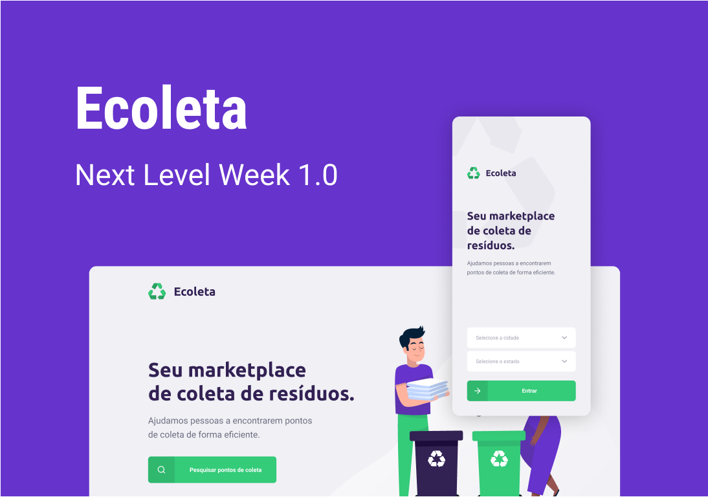

<h1 align="center"></h1>
<p align="center">Project develop in Next Level Week #01</p>
<p align="center">
  <a href="https://nodejs.org/en/">
    
  </a>
  <a href="https://reactjs.org/">
    
  </a>
  <a href="https://reactnative.dev/">
    
  </a>
</p>
<p align="center"></p>

# Índice

- [Sobre](#sobre)
- [Tecnologias Utilizadas](#tecnologias-utilizadas)
- [Como Usar](#como-usar)
- [Como Contribuir](#como-contribuir)

<a id="sobre"></a>

## :bookmark: Sobre

O <strong>Ecoleta</strong> é uma aplicação Web e Mobile para ajudar pessoas a encontrarem pontos de coleta para reciclagem em sua cidade ou região.

## :rocket: Tecnologias Utilizadas

O projeto foi desenvolvido utilizando as seguintes tecnologias

- [TypeScript](https://www.typescriptlang.org/)
- [Knex](http://knexjs.org/)
- [Node.js](https://nodejs.org/en/)
- [ReactJS](https://reactjs.org/)
- [React Native](https://reactnative.dev/)

## :heavy_check_mark: Resultado:

- Em breve

<a id="como-usar"></a>

## :fire: Como utilizar


### :exclamation: Instalação - Back-End (Servidor/API)
Clone o projeto em seu computador. Para instalar as dependências e executar o **Servidor** (modo desenvolvimento) execute:
```bash
cd server
yarn install ou npm install
yarn dev ou npm dev
```

### :exclamation: Instalação - Front-End (Aplicação Web)
Para iniciar o **Frontend** do React utilize os comandos:
```bash
cd web
yarn install ou npm install
yarn start ou npm start
```
Assim que o processo terminar, automaticamente será aberta no seu navegador a página `localhost:3000` contendo o Projeto desenvolvido no dia 3 de 5.

### :exclamation: Mobile

Para ver a aplicação mobile com o React Native, primeiro é necessário colocar o IP do seu servidor (ou computador) no arquivo `src/services/api.js`, e depois executar os comandos:
```bash
# NÃO é preciso executar a linha de baixo caso ja tenha o Expo (CLI) instalado
yarn global add install expo-cli
cd mobile
yarn install
yarn start
```

Assim que o processo terminar, automaticamente será aberta no seu navegador a página `localhost:19002`. Conecte seu emulador, ou teste o aplicativo por `LAN`: baixe o aplicativo *Expo* da Play Store ou App Store e em seguida escaneie o código QR.

### :exclamation: Insomnia 
Para testar a API do Be The Hero, baixe e instale o [Insomnia](https://insomnia.rest/download/) e em seguida clique na Workspace → `Import/Export` → `Import Data` → `From File` → e selecione o arquivo ` 	Insomnia_export.json` deste repositório.

## :recycle: Como contribuir
- Primeiro, deixe uma ⭐ se você gostou!
- Faça um Fork desse repositório;
- Crie uma branch com a sua feature: `git checkout -b my-feature`
- Commit suas mudanças: `git commit -m 'feat: My new feature'`
- Push a sua branch: `git push origin my-feature`

## :memo: License

Esse projeto está sob a licença MIT. Veja o arquivo [LICENSE](LICENSE.md) para mais detalhes.

---

<h4 align="center">
    Feito com 💜 por <a href="https://www.linkedin.com/in/janderson-fa" target="_blank">Janderson Fonseca</a>
</h4>
